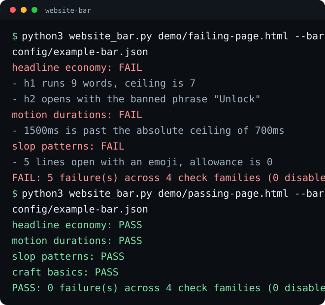

# website-bar

Design taste is usually argued in adjectives. website-bar grades it in numbers. Write a best-in-class standard's measurable habits into one JSON bar and every page you ship gets the same report: rule by rule, pass or fail, with the exact offending string and where it lives. No browser, no dependencies, exit codes for CI.

Point it at a URL or a local HTML file. Exit 0 clears the bar, exit 1
does not, so it drops straight into CI.




## Quick start

```bash
git clone https://github.com/eliferres/website-bar.git
cd website-bar
python3 website_bar.py demo/failing-page.html --bar config/example-bar.json
python3 website_bar.py demo/passing-page.html --bar config/example-bar.json
```

Zero dependencies, Python 3.9+, no network needed for the demo. The two
demo pages are the walkthrough below: one fails the example bar in five
named ways, one clears it.

## The walkthrough

Run the failing page:

```bash
python3 website_bar.py demo/failing-page.html --bar config/example-bar.json
```

Five failures, each naming the string that caused it:

```text
website-bar report
bar: North Star example bar
target: demo/failing-page.html

headline economy: FAIL
  - h1 runs 9 words, ceiling is 7
      found: The complete all-in-one platform for every modern marketing team
      at:    demo/failing-page.html:35
  - h2 opens with the banned phrase "Unlock"
      found: Unlock your potential today
      at:    demo/failing-page.html:39

motion durations: FAIL
  - 1500ms is past the absolute ceiling of 700ms
      found: transition: transform 1500ms ease-in-out
      at:    demo/failing-page.html:30
  - the page animates but never honors prefers-reduced-motion
      at:    demo/failing-page.html

slop patterns: FAIL
  - 5 lines open with an emoji, allowance is 0
      found: 🚀 Fast setup with no configuration
      at:    demo/failing-page.html:46

craft basics: PASS

FAIL: 5 failure(s) across 4 check families (0 disabled in this bar)
```

Fix one of them - the overlong headline:

```bash
python3 - <<'PY'
from pathlib import Path
page = Path("demo/failing-page.html")
page.write_text(page.read_text().replace(
    "The complete all-in-one platform for every modern marketing team",
    "A platform for modern marketing teams"))
PY
python3 website_bar.py demo/failing-page.html --bar config/example-bar.json
```

Four failures left, and the headline economy rule now names only the
banned opener. Put the page back and run the clean one:

```bash
git checkout demo/failing-page.html
python3 website_bar.py demo/passing-page.html --bar config/example-bar.json
echo "exit: $?"
```

`PASS: 0 failure(s) across 4 check families`, exit 0.

For CI or a dashboard, add `--json`:

```bash
python3 website_bar.py demo/failing-page.html --bar config/example-bar.json --json
```

## The bar format, verbatim

A bar is one JSON file. This is `config/example-bar.json` in full - the
numbers are illustrative, and replacing them with habits you measured on
the site you actually admire is the entire setup:

```json
{
  "bar": {
    "name": "North Star example bar",
    "note": "Illustrative numbers. Replace them with habits you measured on the site you actually want to be graded against."
  },
  "checks": {
    "headline_economy": {
      "enabled": true,
      "max_words": { "h1": 7, "h2": 10 },
      "banned_openers": ["Welcome to", "Unlock", "Elevate", "Discover", "Empower"],
      "require_sentence_case": true,
      "title_case_word_allowance": 1,
      "proper_nouns": ["North", "Star", "Monday", "Europe"]
    },
    "motion_durations": {
      "enabled": true,
      "min_ms": 150,
      "max_ms": 400,
      "hard_max_ms": 700,
      "require_reduced_motion": true
    },
    "slop_patterns": {
      "enabled": true,
      "phrases": [
        "in today's fast-paced world",
        "we are thrilled to announce",
        "delve into",
        "seamlessly integrate",
        "game-changing",
        "revolutionize",
        "unlock the power of",
        "take it to the next level",
        "cutting-edge solution",
        "at the end of the day"
      ],
      "max_emoji_bullets": 0
    },
    "craft_basics": {
      "enabled": true,
      "max_font_families": 2,
      "max_colors": 12,
      "require_alt_text": true,
      "require_viewport_meta": true
    }
  }
}
```

Every family carries its own `enabled` flag, so a bar can grade only the
rules you are ready to hold yourself to. Unknown family names are a hard
error rather than a silent no-op.

## What is in the box

| Path | Role |
|---|---|
| `website_bar.py` | The whole tool. Parser, four check families, report, CLI. |
| `config/example-bar.json` | A worked bar config with every option set. |
| `demo/failing-page.html` | Fails the example bar in five named ways. |
| `demo/passing-page.html` | Clears it. The two together are the demo. |
| `tests/test_website_bar.py` | Runs the real CLI over real fixtures, no mocks. |
| `tests/fixtures/` | Small pages with one planted defect family each. |

## What the four families check

**Headline economy.** Word-count ceilings per heading level, banned
filler openers, and a sentence-case rule that flags title-cased headings
while ignoring acronyms and a configured proper-noun list. Long headings
are the most reliable single tell of copy nobody edited.

**Motion durations.** Every `transition` and `animation` duration in
inline styles, `<style>` blocks, and linked stylesheets, graded against a
floor and a ceiling: below the floor reads as jarring, above it as
sluggish, past the hard ceiling as broken. Shorthand delays are not
mistaken for durations. If the page animates at all, it owes a
`prefers-reduced-motion` rule.

**Slop patterns.** Configurable filler phrases matched against the
visible copy, each hit reported with its exact text and line, plus an
emoji-bullet wall counter for the design-side version of the same tell.

**Craft basics.** Distinct font stacks, distinct colors, image alt
coverage, and the viewport meta tag. Each individually toggleable,
because these are the checks teams most often want partially on.

## Why a config, not a linter with opinions

A style guide that lives in a document gets quoted in review and ignored
in a hurry. The same guide as numbers in a file gets run. The point is
not that seven words is the right ceiling for your h1 - it is that you
picked a page you admire, counted, and wrote the number down, so the next
argument is about the number and not about taste. Bars are diffable,
reviewable, and forkable per project: a marketing site and an internal
dashboard should not be graded by the same file.

Determinism is the other half. The same page and the same bar always
produce the same report, which is what makes this safe to put in CI next
to the tests.

## Limitations

- Static analysis only. Nothing is rendered and no JavaScript runs, so
  computed styles, CSS-in-JS, and motion injected at runtime are
  invisible. A page can pass here and still animate badly in a browser.
- Font and color counts are approximate: they count declarations in the
  source, not what actually paints. Design tokens and unused rules both
  inflate them.
- The sentence-case rule is heuristic. Proper nouns outside the
  configured list read as title case, which is a false positive you fix
  by extending the list.
- Slop detection is exact-phrase matching. It catches the clichés you
  name and nothing else; it cannot judge whether a sentence is good.
- A bar encodes one team's taste and inherits its blind spots. Passing
  means "this page keeps the habits we wrote down," never "this page is
  well designed."

## License

MIT
